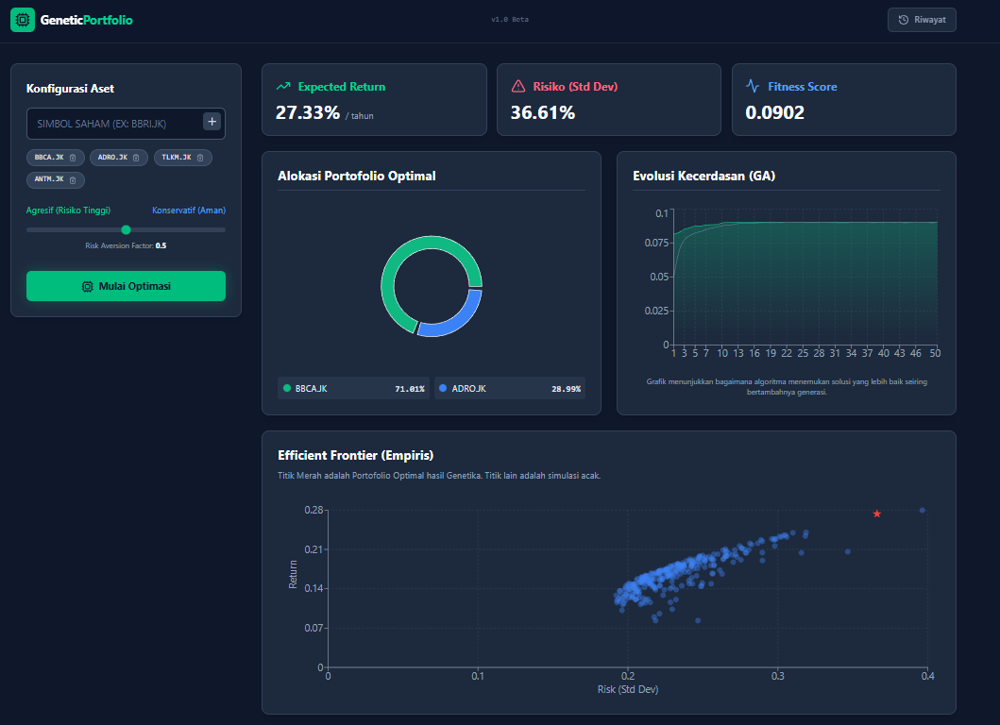

# 🧬 GeneticPortfolio: AI-Powered Portfolio Optimization

GeneticPortfolio is a modern web application that helps investors optimize their asset allocation using **Genetic Algorithms (GA)**. By combining historical data analysis with evolutionary computing, the system finds the optimal balance between **Expected Return** and **Risk (Volatility)** based on the user's risk aversion profile.

This project uses a full-stack architecture integrating **React.js** for visualization, **Node.js** for API management**, and **Python** for computational logic**, with persistent storage using **PostgreSQL (Supabase)**.

---

## 📸 Screenshots



---

## 🚀 Tech Stack

### **Frontend (Client)**

* **Framework:** React.js + Vite
* **Styling:** Tailwind CSS (Dark Mode Fintech Theme)
* **Charts:** Recharts (Pie Charts, Scatter Plots, Area Charts)
* **HTTP Client:** Axios
* **Icons:** Lucide React

### **Backend (Server)**

* **Runtime:** Node.js
* **Framework:** Express.js
* **Database Driver:** `pg` (node-postgres)
* **Process Management:** Child Process (spawning Python engine)

### **Computation Engine (AI)**

* **Language:** Python 3.x
* **Data Source:** yfinance (Yahoo Finance API)
* **Libraries:** Pandas, NumPy

### **Database**

* **System:** PostgreSQL (hosted on Supabase)
* **Storage:** JSONB for complex result caching

---

## 📂 Project Structure

```
portfolio-genetics/
├── client/         # React Frontend Application (Vite)
├── server/         # Express Backend API
├── engine/         # Python Genetic Algorithm Scripts
└── README.md       # Project Documentation
```

---

## 🛠️ Installation & Setup

Follow these steps to run the project locally.

### **1. Prerequisites**

* Node.js (v16 or higher)
* Python (v3.8 or higher)
* PostgreSQL Database (or a Supabase Project)

### **2. Database Setup (Supabase)**

Run the following SQL query in your Supabase SQL Editor:

```
CREATE TABLE optimization_history (
  id SERIAL PRIMARY KEY,
  created_at TIMESTAMP WITH TIME ZONE DEFAULT NOW(),
  tickers TEXT[] NOT NULL,
  risk_aversion DECIMAL NOT NULL,
  result_data JSONB NOT NULL
);

CREATE INDEX idx_history_created_at ON optimization_history(created_at DESC);
```

### **3. Engine Setup (Python)**

```
cd engine
pip install pandas numpy yfinance
```

### **4. Backend Setup (Server)**

```
cd server
npm install
```

Create a `.env` file:

```
PORT=5000
DATABASE_URL="postgres://..."
```

Run the server:

```
npm run dev
```

### **5. Frontend Setup (Client)**

```
cd client
npm install
npm run dev
```

Open your browser at: [http://localhost:5173](http://localhost:5173)

---

## 💡 How to Use

1. **Input Tickers**: (Example: `BBCA.JK`, `ADRO.JK`, `AAPL`, `TSLA`)
2. **Set Risk Profile**: Adjust risk aversion slider (0.0 = aggressive, 1.0 = conservative)
3. **Start Optimization**: Python engine runs GA (5–20 sec)
4. **Analyze Results**: Pie chart, scatter plot (efficient frontier), area chart (fitness improvement)
5. **History**: Load past simulations stored in Supabase

---

## 🧠 Genetic Algorithm Logic

* **Initialization**: Random population of portfolios
* **Fitness Evaluation**: Return - (Risk_Aversion * Risk)
* **Selection**: Tournament selection
* **Crossover**: Mix parent weights
* **Mutation**: Random adjustments
* **Elitism**: Preserve best individuals

---

## 🚧 Roadmap

* [x] Core Genetic Algorithm Engine
* [x] Interactive Web Visualization
* [x] Database Integration (History)
* [ ] Mutual Funds Support: Ability to upload local CSV data for assets not listed on Yahoo Finance.
* [ ] Detailed Report: Downloadable PDF/Excel reports.
* [ ] User Authentication: Multi-user support.

## 📝 License

MIT License
